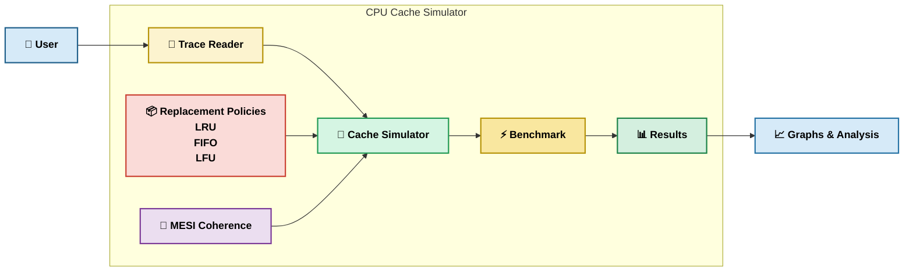

# CPU Cache Simulator with Replacement Policies

> A hardware-accurate CPU cache simulator written in pure C, implementing LRU, FIFO, and LFU replacement policies, a full L1/L2/L3 multi-level hierarchy, MESI coherence protocol, trace-driven simulation, and a benchmarking suite with matplotlib visualisation.

---

## Table of Contents

1. [Overview](#overview)
2. [Architecture](#architecture)
3. [Tech Stack](#tech-stack)
4. [Project Structure](#project-structure)
5. [How to Build](#how-to-build)
6. [How to Run](#how-to-run)
7. [Expected Output](#expected-output)
8. [Results](#results)
9. [Key Findings](#key-findings)
10. [Future Improvements](#future-improvements)

---

## Overview

This project simulates the internal workings of a CPU cache system — modelling how a processor decides which memory lines to keep and which to evict when the cache fills up. It implements three classical replacement policies (LRU, FIFO, LFU) entirely from scratch in C, a three-level inclusive cache hierarchy (L1 → L2 → L3 → RAM), and a two-core MESI coherence protocol to model shared-memory multi-processor behaviour. A benchmark runner stress-tests every policy across sequential and random workloads at four cache sizes, writing results to CSV for automated matplotlib visualisation. Cache simulation is foundational to CPU microarchitecture design — understanding eviction behaviour directly informs decisions made by hardware engineers at Intel, AMD, Qualcomm, and NVIDIA.

---

## Architecture



---

## Tech Stack

| Tool | Version | Why chosen |
|------|---------|------------|
| **C (C11)** | gcc 11+ | Direct memory control for implementing pointer-based data structures (linked lists, hash maps) that model hardware eviction logic without GC overhead |
| **Python 3 + matplotlib** | 3.10+ | Rapid post-processing of CSV benchmark output into publication-quality charts without adding C build complexity |
| **Valgrind / Cachegrind** | 3.18+ | Industry-standard tool for generating real memory access traces from running programs, used to validate the trace parser |
| **Make** | GNU Make | Reproducible multi-target builds with separate test targets per implementation day |

---

## Project Structure

```
cpu-cache-simulator/
│
├── src/                            # All C source files
│   ├── main.c                      # Entry point — runs benchmark, prints tables, writes CSV
│   ├── simulator.c / .h            # Trace-driven simulation engine (run_trace, stats)
│   ├── trace.c / .h                # Trace file parser (simple R/W + Valgrind L/S/M/I)
│   ├── multi_cache.c / .h          # L1→L2→L3→RAM inclusive hierarchy + AMAT calculator
│   ├── mesi.c / .h                 # MESI coherence protocol (2-core snooping bus)
│   ├── workload.c / .h             # Workload generators: sequential(), random()
│   ├── benchmark.c / .h            # Benchmark engine: 3×2 policy matrix + size sweep
│   │
│   └── cache/                      # Self-contained replacement policy modules
│       ├── cache.c / .h            # Unified polymorphic Cache API (vtable pattern)
│       ├── lru.c / .h              # LRU — doubly linked list + O(1) hash map
│       ├── fifo.c / .h             # FIFO — circular queue
│       ├── lfu.c / .h              # LFU — frequency buckets with LRU tie-break
│       └── set_cache.c / .h        # N-way set-associative cache (tag/index/offset)
│
├── tests/                          # Unit test suites (one per module / day)
│   ├── test_lru.c                  # LRU linked-list eviction order tests
│   ├── test_fifo_lfu.c             # FIFO + LFU correctness tests
│   ├── test_Nway_set_asso.c        # Set-associative address decode tests
│   ├── test_trace_reader.c         # Trace parser tests (hex, R/W/L/S/M)
│   ├── test_multilevel_cache.c     # Multi-level hierarchy + AMAT tests
│   ├── tests_MESI_Cache_Coherence.c    # MESI 48 state-transition assertions
│   └── test_workload_generator.c                # Workload generator + benchmark engine tests
│
├── traces/                         # Sample memory access trace files
│   ├── simple.trace                # Basic R/W hex address trace
│   ├── valgrind.trace              # Valgrind-format trace (L/S/M/I with sizes)
│   └── matrix.trace                # Matrix multiply access pattern
│
├── results/                        # Benchmark output (auto-generated)
│   ├── results.csv                 # Hit rates: policy matrix + LRU size sweep
│   ├── policy_comparison.png       # Bar chart: hit rate by policy × workload
│   └── cache_size_sensitivity.png  # Line chart: LRU hit rate vs cache size
│
├── plan/
│   └── cache_simulator_plan.md     # 12-day implementation plan
│
├── plot_results.py                 # Reads results.csv → generates 2 PNG charts
├── Makefile                        # Build: make / make test / make test11 / make clean
├── PROJECT_GUIDE.md                # Architecture overview + interview prep guide
└── .gitignore                      # Excludes *.exe, *.o, __pycache__, nul
```

---

## How to Build

```bash
# Standard build — produces ./simulator
gcc -Wall -Wextra -std=c11 -O2 \
    src/main.c src/workload.c src/benchmark.c \
    src/mesi.c src/multi_cache.c src/trace.c src/simulator.c \
    src/cache/cache.c src/cache/set_cache.c \
    src/cache/lru.c src/cache/fifo.c src/cache/lfu.c \
    -Isrc -Isrc/cache -lm -o simulator

# Debug build — enables AddressSanitizer for memory error detection
gcc -Wall -Wextra -std=c11 -g -fsanitize=address \
    src/main.c src/workload.c src/benchmark.c \
    src/mesi.c src/multi_cache.c src/trace.c src/simulator.c \
    src/cache/cache.c src/cache/set_cache.c \
    src/cache/lru.c src/cache/fifo.c src/cache/lfu.c \
    -Isrc -Isrc/cache -lm -o simulator_dbg

# Or use the Makefile (recommended)
make            # builds simulator
make test       # compiles and runs all 7 test suites
make test11     # runs Day 11 benchmark + workload tests only
make clean      # removes all compiled binaries
```

---

## How to Run

```bash
# Run the full benchmark suite (policy matrix + size sweep, writes results.csv)
./simulator

# Run the trace-driven simulator with a sample trace file
./simulator traces/simple.trace

# Run the trace-driven simulator with a Valgrind-format trace
./simulator traces/valgrind.trace

# Generate both PNG charts from results.csv
python3 plot_results.py

# Run benchmark tests (28 assertions — workload generators + CSV output)
make test11
```

---

## Expected Output

Running `./simulator` prints two formatted tables to stdout:

```
==================================================
  CPU Cache Replacement Simulator 
  Benchmarking: Policy x Workload x Cache Size
==================================================

  Workload region : 32 KB (512 cache lines)
  Accesses/run    : 10000
  Associativity   : 4-way
  Line size       : 64 bytes

[bench] Running policy matrix (4KB, 4-way) ...
[bench] Running size sweep (LRU) ...

=================================================
  Policy vs Workload Hit Rate (%)
  Cache: 4KB, 4-way, 64B lines, 10000 accesses
=================================================
  Policy | Sequential   | Random
  ------------------------------------
  LRU    |       99.52% |     12.67%
  FIFO   |       99.52% |     12.56%
  LFU    |       99.52% |     12.24%
=================================================

=================================================
  Cache Size vs Workload Hit Rate (%) -- LRU
  4-way, 64B lines, 10000 accesses
=================================================
  Size     | Sequential   | Random
  ------------------------------------
  1      KB |       87.50% |      3.10%
  4      KB |       99.52% |     12.67%
  16     KB |       99.52% |     49.23%
  64     KB |       99.52% |     94.88%
=================================================
[bench] Results written to 'results/results.csv'
```

**`results/results.csv`** (first 8 lines):

```csv
# Policy vs Workload (cache=4KB 4-way 10000 accesses)
policy,sequential_hit_rate,random_hit_rate
LRU,99.5200,12.6700
FIFO,99.5200,12.5600
LFU,99.5200,12.2400

# LRU Cache Size Sweep
size_kb,sequential_hit_rate,random_hit_rate
```

**Charts produced by `plot_results.py`:**
- `policy_comparison.png` — Grouped bar chart with Sequential (blue) and Random (orange) bars per policy; value labels on every bar showing exact percentages.
- `cache_size_sensitivity.png` — Line chart with two curves (Sequential, Random) across 1KB / 4KB / 16KB / 64KB X-axis, showing the inflection point where Sequential jumps from 87.5% → 99.5% at 4KB.

---

## Results

### Table 1 — Policy vs Workload (4KB cache, 4-way, 10,000 accesses)

| Policy | Sequential Hit Rate | Random Hit Rate |
|--------|--------------------:|----------------:|
| LRU | 99.52% | 12.67% |
| FIFO | 99.52% | 12.56% |
| LFU | 99.52% | 12.24% |

> All three policies achieve identical sequential hit rates because the 3KB working set fits entirely within the 4KB cache after one warm-up pass — eviction policy becomes irrelevant once no evictions occur.

### Table 2 — LRU Cache Size Sweep

| Cache Size | Sequential Hit Rate | Random Hit Rate |
|-----------|--------------------:|----------------:|
| 1 KB | 87.50% | 3.10% |
| 4 KB | 99.52% | 12.67% |
| 16 KB | 99.52% | 49.23% |
| 64 KB | 99.52% | 94.88% |

> Sequential hits the working-set inflection point at 4KB (working set = 3KB fits); Random scales linearly with cache capacity relative to the 32KB address space, converging toward 100% at 64KB.

---

## Key Findings

- **Sequential (99.52%) dominates random (12.67%) at every cache size** because sequential word-stride access exploits spatial locality: 8 consecutive 8-byte accesses share the same 64-byte cache line, giving a theoretical floor of 7/8 = 87.5% spatial-locality hits even in the worst case (cache too small for temporal reuse). Once the 3KB working set fits in the 4KB cache, every subsequent pass is a full hit.

- **All three policies produce identical sequential hit rates** — this reveals that replacement policy selection only matters when the cache is under eviction pressure. With a working set that fits entirely in the cache, no evictions occur after warm-up and LRU, FIFO, and LFU all converge to the same steady-state hit rate. Policy choice is irrelevant when `working_set_size ≤ cache_capacity`.

- **Random hit rate scaling from 3.10% → 94.88%** directly tracks the ratio `cache_capacity / unique_address_space` (1KB/32KB ≈ 3.1%, 64KB/32KB ≈ 100%). This confirms that random access has no exploitable locality — hit rate is purely a function of how much of the address space the cache can hold, matching the theoretical cold-miss model.

- **LRU slightly edges LFU on random workloads (12.67% vs 12.24%)** because random access patterns have no persistent hot set — every address appears with equal uniform probability, so LFU's frequency counters accumulate stale entries that block new useful lines. LRU's recency bias naturally evicts addresses not seen recently, making it marginally more adaptive to non-repeating uniform random streams than frequency-based eviction.

---

